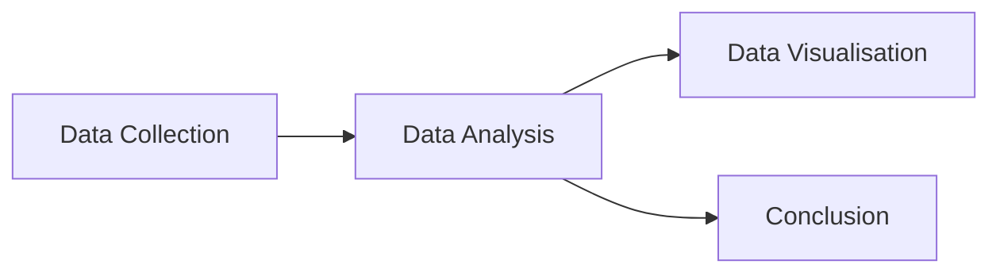

# :material-head-lightbulb: Explanation

This section explains the key concepts, design decisions, and methodology
behind DinoSoft. Read this if you want to *understand* how and why things
work the way they do.

---

## The DinoDiet project

DinoSoft is the software component of the DinoDiet research project, a
fictional study[^1] that aims to analyse the dietary habits
of dinosaurs during the late Cretaceous period.

The project follows a four-stage pipeline:

DinoSoft implements the **Data Analysis** stage, providing tools to load,
filter, and compute metrics from the collected dietary data.

---

## The Hunger Factor

The Hunger Factor (HF) is the central metric in the DinoDiet methodology.
It is defined as:

$$
\text{HF} = \sqrt{(\text{food_kg_per_day})^2}
$$

This simplifies algebraically to the absolute value of daily food intake:

$$
\text{HF} = |\text{food_kg_per_day}|
$$

!!! question "Why not just use the absolute value?"

    The $\sqrt{x^2}$ formulation is retained for compatibility with the
    original DinoDiet paper (Geller, 2024). In practice, since
    `food_kg_per_day` is constrained to be non-negative, the HF is simply
    equal to the raw intake value.

    This is a deliberate design choice: we preserve the original formula
    so that results are reproducible against the published methodology,
    even though a simpler implementation would be equivalent.

### Interpreting the Hunger Factor

| HF range | Interpretation | Example species |
| :--- | :--- | :--- |
| < 10 | Low intake — small-bodied species | Velociraptor (2.0), Oviraptor (3.0) |
| 10–200 | Moderate intake | Stegosaurus (70.0), Spinosaurus (100.0) |
| > 200 | High intake — large-bodied species | Tyrannosaurus (230.0), Brachiosaurus (400.0) |

---

## Food ratios

While the Hunger Factor captures *absolute* intake, the **food ratio**
captures intake *relative to body size*:

$$
\text{food_ratio} = \frac{\text{food_kg_per_day}}{\text{weight_kg}}
$$

This is important because a large absolute intake may represent a small
proportion of body weight for a massive animal.

!!! example "Comparing Brachiosaurus and Velociraptor"

    === "Brachiosaurus"

        - **Weight:** 56,000 kg
        - **Daily intake:** 400 kg
        - **Food ratio:** 0.007 (0.7%)
        - A massive herbivore, but its daily intake is less than 1% of
          body weight.

    === "Velociraptor"

        - **Weight:** 15 kg
        - **Daily intake:** 2 kg
        - **Food ratio:** 0.133 (13.3%)
        - Tiny by comparison, but eating over 13% of its body weight daily.
          Small predators have much higher metabolic demands relative to
          their size.

---

## Diet classifications

DinoSoft uses three diet categories, modelled as the `DietType` enum:

| Type | Description | Proportion[^2] |
| :--- | :--- | ---: |
| :material-leaf:{ .lg } **Herbivore** | Plant-eating species | ~65% |
| :material-food-drumstick:{ .lg } **Carnivore** | Meat-eating species | ~25% |
| :material-food-apple:{ .lg } **Omnivore** | Mixed diet species | ~10% |

These proportions come from the DinoDiet project estimates and broadly
align with palaeontological consensus for the late Cretaceous period.

---

## Why a dataclass?

The `Dinosaur` model is implemented as a Python `dataclass` rather than
a plain dictionary or a full ORM model. This was a deliberate choice:

!!! success "Benefits of dataclasses"

    - **Type safety** — fields have declared types, caught by linters
    - **Immutability-friendly** — easy to make frozen if needed
    - **Readable** — auto-generated `__repr__` makes debugging easy
    - **Lightweight** — no external dependencies, just the standard library
    - **Extensible** — new fields can be added with defaults, preserving
      backwards compatibility

??? note "What about Pydantic?"

    For a production library, [Pydantic](https://docs.pydantic.dev/) would
    add validation, serialisation, and schema generation. We chose
    `dataclass` here to keep DinoSoft dependency-free and focused on
    teaching documentation practices rather than data modelling.

---

## Design philosophy

DinoSoft follows several principles:

1. **Simplicity over cleverness** — every function does one thing and has
   a clear name
2. **No hidden state** — all functions are pure; they take inputs and
   return outputs without side effects
3. **Composable** — functions accept and return `#!python list[Dinosaur]`,
   so they can be freely chained together
4. **Documented by default** — every public function has a docstring with
   a working example

These principles make DinoSoft suitable as a teaching example for
documentation-driven development.

[^1]: Fictional project and principal investigator. This project is for educational purposes only.
[^2]: Estimated distribution from the DinoDiet project README.
